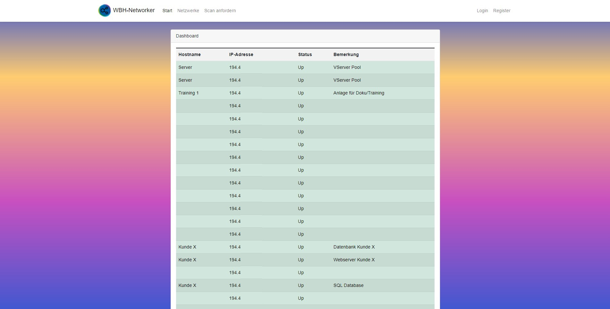

# WebApp

Zuerst gelang man auf die Dashboard Seite, auf der man einen Überblick über die aktiven Hosts eines Netzwerksegmentes erhält.

Möchte der Nutzer die Hostnamen, Bemerkungen oder das ganze Netzwerksegment ändern, muss dieser sich zuerst Registrieren oder einloggen. 
Eingeloggte User können nun über das Dashboard die jeweiligen Hostnamen und Bemerkungen editieren sowie die Logs ansehen.  
Die Benutzerverwaltung steht lediglich den Admins zur Verfügung. Dort können die Admins die
Benutzerdaten anpassen, Rollen verteilen und Benutzer aus dem System entfernen.

# Migration

-   Nginx bereitstelen
-   Datenbank bereitstellen
    -   Benutzer erstellen
    -   Rechte vergeben
-   PHP 8 installieren
-   Composer bereitstellen
-   WebApp importieren
-   Laravel konfigurieren
    -   .env anpassen
    -   Datenbankmigrations durchführen
-   Nginx einrichten
